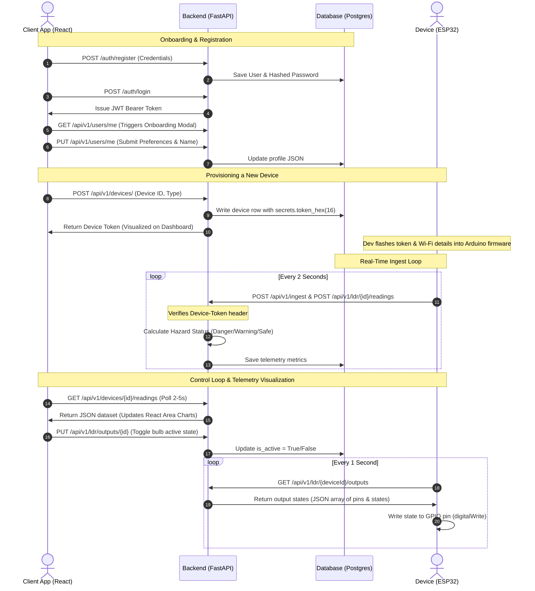

# Freelance Project Analysis & Valuation Report: SenseGrid IoT Dashboard

This document provides a professional, comprehensive project analysis and valuation report for the **SenseGrid** full-stack Internet of Things (IoT) monitoring and control platform (also referenced as the **TRONIX365 Indianiiot** system). 

This report is structured for developers, freelancers, and clients to assess the scope, architecture, complexity, and commercial value of the project.

---

## 1. Project Overview

| Attribute | Details |
| :--- | :--- |
| **Project Name** | SenseGrid (TRONIX365 Indianiiot Combined Gas & Light Monitoring System) |
| **Primary Purpose** | A full-stack IoT platform for real-time telemetry (combustive/toxic gases, temperature, humidity, and proximity) and automated/manual control of hardware outputs (smart relays/switches) using ESP32 controllers. |
| **Problems Solved** | 1. **Environmental Hazard Mitigation**: Solves the issue of toxic/combustive gas buildup (via MQ135) and physical intrusion detection (via Ultrasonic sensor).<br>2. **Automated Illumination**: Solves high power consumption and manual effort in outdoor/industrial lighting (via LDR analog brightness mapping & PWM dimming).<br>3. **Unified Remote Control**: Eliminates isolated local controls by exposing physical pins as toggles on a cloud-accessible dashboard.<br>4. **Network Adaptation**: Allows offline LAN setup (for remote industrial sites) or full cloud deployment. |
| **Target Users** | Smart home owners, facility managers, agricultural greenhouse operators, industrial safety monitors, and warehousing managers. |
| **Business Value** | Minimizes physical monitoring labor, mitigates fire and chemical hazards, automates energy usage for lighting, provides real-time alerts, and avoids high licensing costs of generic platforms (e.g., Blynk, Thingsboard). |

---

## 2. Complete Feature List

The project features are divided into distinct modules, spanning the backend API, the client web dashboard, and the ESP32 hardware firmware.

### A. Authentication & User Management Module
*   **User Registration**: Creates user accounts with email, password, full name, and phone number. Implements server-side duplicate checks.
*   **User Login**: Issues secure OAuth2 JSON Web Tokens (JWT) upon credentials verification.
*   **Session Management**: Frontend React Auth Context maintains login states across pages, auto-refreshing profile information.
*   **Custom User Preferences**: A JSON database column stores individual user customizations (e.g., custom UI sensor icons) that sync automatically across devices.
*   **User Profile Updates**: Allows users to update names, phone numbers, and customize interface configurations in real-time.

### B. Device Management Module
*   **Device Registration**: Users register new hardware devices by specifying a unique Device ID (e.g., `ESP32_FUSION_01`) and Device Type (`gas_sensor`, `ldr_sensor`, `combined_sensor`).
*   **Secure Token Generation**: The backend auto-generates cryptographically secure API tokens (`secrets.token_hex(16)`) for each hardware device to prevent telemetry spoofing.
*   **Device Status Monitoring**: Tracks registered devices and displays connection details.
*   **Device Deletion (Cascading cleanup)**: Safely removes a device and automatically purges all historical sensor readings, LDR telemetry, and active outputs from the DB.

### C. Gas & Proximity Monitoring Module (GasDashboard)
*   **Real-time Telemetry Polling**: Frontend fetches fresh environment stats every 5 seconds.
*   **Multi-Sensor Data Tracking**:
    *   **Air Quality (Gas Level)**: Real-time air composition tracking in parts-per-million (ppm).
    *   **Temperature**: Environmental temperature in °C.
    *   **Humidity**: Environmental relative humidity percentage (%).
    *   **Proximity (Distance)**: Ultrasonic distance monitoring in centimeters (cm).
*   **Automatic Hazard Assessment**: Server-side logic (`calculate_status`) evaluates measurements and flags state:
    *   `DANGER`: Triggered if gas level > 1000 ppm OR ultrasonic proximity < 20 cm.
    *   `WARNING`: Triggered if gas level > 500 ppm OR temperature > 40°C.
    *   `SAFE`: Nominal levels.
*   **Dynamic Visual Indicators**: Visual cards glow with colors relative to hazard levels (Emerald for Safe, Amber for Warning, Red for Danger).
*   **Interactive Trend Visualizations**:
    *   **Gas Trends Chart**: A Recharts-based area chart showing temporal changes in air quality.
    *   **Environment Trends Chart**: Dual-area chart displaying Temperature and Humidity correlation.
*   **Sensor Icon Customization**: Users click on any card to select custom Lucide icons via a sidebar, persisting choices to the database.

### D. Smart Light Automation Module (LDRDashboard)
*   **High-Frequency Telemetry**: Polls light sensors every 1 second for immediate status updates.
*   **Dual Value Reading**:
    *   **Analog Intensity**: Light level (0-4095 range from ESP32 12-bit ADC).
    *   **Digital Status**: Threshold indicator representing binary active/inactive (night/day) state.
*   **Actuator Control Deck**: Displays configurable electrical outputs (e.g., bulbs, fans, pumps).
*   **Dynamic Output Creation**: Allows registration of new output switches mapping directly to specific ESP32 GPIO pins.
*   **Manual Override Toggles**: Interactive sliding toggles to switch physical relays on/off.
*   **Illumination Trend Chart**: Interactive chart mapping historical light levels.
*   **AutoBulb Visualizer**: React component rendering a simulated light bulb that dynamically changes glow intensity based on analog light sensor readings.

### E. Unified telemetry Dashboard (UnifiedDashboard - Fusion Core)
*   **Bento-Grid Dashboard**: Displays Gas, Temperature, Humidity, and Light Intensity side-by-side.
*   **Telemetry Correlation Chart**: A dual-axis area chart overlaying Air Quality (PPM) against Light Intensity (LUX) for environment assessment.
*   **Unified Control Deck**: Centralized management panel displaying environmental readings alongside manual GPIO toggles.

### F. ESP32 Firmware Module (Arduino C++)
*   **Local Automations (Zero-Latency Local Loop)**: ESP32 reads analog light sensors and directly maps the input to a PWM LED output (AutoBulb) in the local control loop, bypassing network lag.
*   **Periodic Data Ingestion**: Uploads telemetry packets to backend REST endpoints (`/api/v1/ingest`, `/ldr/.../readings`) via secure JSON payloads over HTTP/HTTPS.
*   **Outbound Authorization Headers**: Packages the generated device token into custom HTTP headers (`Device-Token`) for API security.
*   **Actuator Command Polling**: Polls the server's output configuration database and modifies physical GPIO pins (`digitalWrite`) to mirror the user's dashboard toggles.
*   **Hardware Safety Interlocks**: The firmware hardcodes a safeguard to block instructions requesting writes to input pins (e.g. MQ135 or LDR pins), preventing ESP32 short-circuits.

---

## 3. User Flow

The complete flow from onboarding a new user to real-time telemetry and control execution is detailed below:



---

## 4. Technical Architecture

The architecture relies on a highly modular, decoupled client-server-device setup designed to scale and remain responsive.

```
                  ┌──────────────────────────────┐
                  │      React 19 Frontend       │
                  │   (Vite, Tailwind, Recharts)  │
                  └──────────────┬───────────────┘
                                 │ HTTP / REST
                                 ▼
                  ┌──────────────────────────────┐
                  │       FastAPI Backend        │
                  │     (OAuth2, JWT, bcrypt)    │
                  └──────────────┬───────────────┘
                                 │ SQLAlchemy ORM
                                 ▼
                  ┌──────────────────────────────┐
                  │    PostgreSQL / Neon DB      │
                  │    (Users, Devices, Logs)    │
                  └──────────────▲───────────────┘
                                 │ HTTP REST (Auth Header)
                                 │
                  ┌──────────────┴───────────────┐
                  │        ESP32 Hardware        │
                  │   (MQ135, LDR, Ultrasonic)   │
                  └──────────────────────────────┘
```

### Technical Stack Summary
*   **Frontend**: 
    *   *React 19 + Vite*: High-speed hot module replacement, optimized production bundles.
    *   *Tailwind CSS v4*: Modern utilities for styling.
    *   *Framer Motion*: Powers micro-animations, transitions, and slide-out panels.
    *   *Recharts*: SVG-based responsive data charting.
*   **Backend**:
    *   *FastAPI (Python)*: High performance, auto-generated OpenAPI documentation, fast async request processing.
    *   *SQLAlchemy ORM*: Database abstraction layer.
    *   *Pydantic*: Input validation and response serialization.
*   **Database**:
    *   *PostgreSQL*: Production-grade database. Integrates with **Neon** serverless Postgres for database scaling.
    *   *SQLite*: local fallback enabled out-of-the-box in code (`server/app/database.py`) to support offline testing.
*   **Authentication & Security**:
    *   *Passlib + bcrypt*: Secure salted password hashing on the server.
    *   *PyJWT*: Encrypted authorization tokens.
    *   *Device Header Tokens*: Custom string authentication for hardware nodes.
*   **Deployment Targets**:
    *   *Frontend*: Cloudflare Pages (Custom domain mapping, edge-cached delivery).
    *   *Backend*: Render (Pipelined deployment from GitHub).
    *   *Database*: Neon cloud hosting.

---

## 5. Development Complexity Analysis

To estimate valuation, the codebase is assessed based on module complexity.

### Complexity Matrix

| Module / Component | Complexity Tier | Complexity Score (1-10) | Core Technical Challenges |
| :--- | :---: | :---: | :--- |
| **Auth & Profile Management** | Intermediate | 5/10 | JWT lifetime configuration, secure route guarding, dynamic onboarding interception. |
| **Device Configuration Engine** | Intermediate | 6/10 | Generating API tokens, preventing registration collisions, implementing cascade deletes. |
| **Real-time Telemetry Engine** | Advanced | 8/10 | Handling concurrent ingestion packets, executing safety threshold heuristics quickly, managing time-series database records. |
| **Dynamic Charting & Analytics** | Intermediate | 6/10 | Syncing multi-sensor polling frequencies, rendering responsive graphs without memory leaks. |
| **Manual Remote Actuation** | Advanced | 8/10 | Polling rate optimization to avoid server overload, minimizing latency between user click and hardware switch execution. |
| **ESP32 Firmware Core** | Advanced | 9/10 | Memory optimization in C++, network drop recovery, PWM dimming loops, parsing JSON payloads on resource-constrained chips. |
| **Deployment & Pipeline Setup** | Intermediate | 6/10 | CORS configurations, managing environmental variables between frontend and backend, configuring local firewall rules. |

---

## 6. Development Timeline

A standard freelance execution timeline for this project, assuming a professional full-stack engineer:

### Phase Estimation Breakdown

```mermaid
gantt
    title Project Implementation Schedule
    dateFormat  D
    axisFormat %d
    section Phase 1: Architecture
    Database & API Setup          :active, 1, 5
    section Phase 2: Firmware
    ESP32 Core & Wifi Loop        : 5, 10
    section Phase 3: Frontend
    Responsive Dashboards & Recharts : 10, 18
    section Phase 4: Control Loop
    Remote Control & Security Tuning : 18, 22
    section Phase 5: QA & Cloud
    Testing, Integration & Deploy : 22, 26
```



| Phase | Tasks Included | Estimated Hours |
| :--- | :--- | :---: |
| **Phase 1: Database & API Foundation** | Schema creation, FastAPI router setup, JWT and device authentication middleware. | 25 Hours |
| **Phase 2: ESP32 Hardware Integration** | Pin configuration, local automation code, JSON compilation, HTTP client implementation, reconnect loops. | 35 Hours |
| **Phase 3: Client Dashboard & Visuals** | Bento layouts, dark mode components, Recharts configuration, profile custom icon picker, responsive styling. | 45 Hours |
| **Phase 4: Remote Control & State Synchronization** | Actuator API design, polling logic optimization, AutoBulb sync component, error handling. | 20 Hours |
| **Phase 5: Quality Assurance & Deployment** | Multi-device simulation testing, CORS resolution, Render/Cloudflare pipelines, documentation. | 15 Hours |
| **Total Estimated Effort** | **Full-Cycle Engineering** | **140 Hours** |

### What Takes the Most Time?
1.  **Hardware Ingestion & Parsing Stability**: Writing C++ code that handles Wi-Fi disconnections without locking up the ESP32, and parsing complex JSON strings on-device without memory leaks.
2.  **State Synchronization**: Tuning the polling intervals between the client dashboard, the database, and the hardware device to make toggles feel instantaneous.
3.  **Cross-Origin (CORS) & LAN Routing**: Configuring route settings, network configurations, and OS firewall adjustments to support offline local connections.

---

## 7. UI/UX Assessment

The application utilizes a dark "Glassmorphic" command center style to present data-dense layouts cleanly.

### Interface Details
*   **Total Page Templates**: 6 core pages
    1.  *Authentication pages* (Login and Registration forms).
    2.  *Master Dashboard (Mission Control)*: Displays total active devices, general connectivity health, and quick actions.
    3.  *Device Inventory Page*: Interface to register, inspect, and delete devices.
    4.  *Gas Detail Dashboard*: Air quality metrics, hazard state banners, environment graphs.
    5.  *Light Automation Dashboard*: Relays control cards, analog sensor metrics, and AutoBulb visualizers.
    6.  *User Profile Page*: Settings, metadata, and custom sensor icon mapping.
*   **Mobile Responsiveness**: Designed using a CSS Flexbox/Grid architecture to display cleanly on mobile devices.
*   **UX Visual Highlights**:
    *   *Ambient Neon Glows*: Dynamic gradient drops indicating active hazards.
    *   *Micro-Animations*: Leverages Framer Motion to animate onboarding steps, sidebars, and card highlights.
    *   *AutoBulb Visual Component*: Renders a light bulb icon that glows brighter/dimmer in real-time based on actual light sensor readings.

---

## 8. Security Audits & Best Practices

The system includes several built-in security features:

1.  **Authorization Safeguards**: User endpoints require signed Bearer tokens verify signature before querying.
2.  **Device Spoofing Prevention**: Hardware nodes must supply a cryptographically generated API token via a custom `Device-Token` header.
3.  **Password Safety**: Implements salt and bcrypt hashing, preventing plaintext storage.
4.  **Hardware Overwrite Protection**: The ESP32 firmware includes rules that ignore user request commands to write to critical input pins, protecting sensors from damage.
5.  **CORS Domain Whitelisting**: The API blocks scripts originating from unauthorized domains.

---

## 9. Business Value & USPs

### Unique Selling Points (USP)
*   **Local LAN Mode (Offline Survivability)**: Unlike platforms such as AWS IoT Core or Blynk, which stop working if the internet goes down, SenseGrid can run entirely on a local router without internet access, making it highly reliable for remote warehouses or farms.
*   **Customization Engine**: Users can customize their dashboards with dynamic icon Pickers, allowing them to personalize individual nodes.
*   **Low Maintenance Cost**: Built using open-source database backbones (FastAPI + Postgres) to avoid expensive, ongoing subscription fees.

### Economic Impact
*   *Energy Efficiency*: Automates lighting systems based on actual ambient lux values, cutting unnecessary electrical costs.
*   *Asset Safety*: Provides early warnings for toxic gas buildups or chemical leaks, protecting physical inventory and personnel.
*   *Immediate Relamping Diagnostics*: The dashboard highlights discrepancies in hardware outputs, indicating when a physical light bulb or relay has failed.

---

## 10. Market Comparison

| Feature / Category | SenseGrid (This App) | Blynk IoT Platform | Thingsboard (Open Source) | Home Assistant |
| :--- | :---: | :---: | :---: | :---: |
| **Self-Hosting Options** | Simple (Render / Local) | Complex Setup | Very Heavy | Complex (Raspberry Pi) |
| **Custom Branding / White-label** | Included (Open Source) | Expensive Tier | Paid License | Not Native |
| **LAN-Only Operation** | Supported natively | Difficult | Unsupported | Supported |
| **Cost Model** | One-time / Free Cloud | Subscription | Heavy Server Cost | Hardware setup costs |
| **Dashboard Customization** | Dynamic Icon Picker | Drag & Drop | Component Widgets | Lovelace Configs |

---

## 11. Freelance Valuation & Pricing Model

For a professional project handover, the pricing is determined by three main categories:

### A. Feature Count & Custom Code (50% Value)
*   6 separate database tables with cascade relations.
*   5 distinct backend controllers (FastAPI).
*   9 responsive frontend layouts with bento designs.
*   C++ ESP32 firmware containing automation loops and API integration.

### B. Hardware Integration & Security (30% Value)
*   Cryptographic token exchange structure for hardware requests.
*   Local loop PWM mapping combined with cloud control.
*   Protection logic preventing hardware short circuits.

### C. Deployment & Handover Ready (20% Value)
*   Ready-to-use Render and Cloudflare deployment pipelines.
*   Neon cloud database integration.
*   Dual-mode database configurations (SQLite/Postgres).

### Suggested Pricing Tiers

Based on typical market rates for full-stack developers:

| Valuation Model | Hourly Rate | Estimated Hours | Total Project Valuation |
| :--- | :---: | :---: | :---: |
| **Junior / Entry-Level Rate** | $25 / hr | 140 | **$3,500** |
| **Mid-Level Freelancer** | $50 / hr | 140 | **$7,000** |
| **Senior IoT Solutions Engineer** | $85 / hr | 140 | **$11,900** |

---

## 12. Client Handover Checklist

Upon delivery of this project, the developer should hand over:

1.  **Source Code Repositories**:
    *   `client/` folder: The React web application.
    *   `server/` folder: The FastAPI backend service.
    *   `firmware/` folder: The ESP32 Arduino sketches.
2.  **System Documentation**:
    *   [README.md](file:///c:/Users/Hi/Desktop/Indianiiot/README.md): Setup commands and dependency listings.
    *   [SETUP_GUIDE.md](file:///c:/Users/Hi/Desktop/Indianiiot/SETUP_GUIDE.md): Local database installation instructions.
    *   [DEPLOYMENT_GUIDE.md](file:///c:/Users/Hi/Desktop/Indianiiot/DEPLOYMENT_GUIDE.md): Cloud hosting instructions.
3.  **Active Cloud Accounts**:
    *   Render service ownership transfer.
    *   Cloudflare Pages domain pointing access.
    *   Neon database administration keys.
4.  **Hardware Wiring Schematics**: Pin-mapping layout instructions detailing how to connect the ESP32, MQ135, LDR, and Ultrasonic sensors.

---

## 13. Final Summary

*   **Total Feature Points**: 24 distinct functionalities across Web, API, and Firmware.
*   **Project Complexity**: **Intermediate-to-Advanced** (due to hardware-software synchronization, custom communication tokens, and real-time polling).
*   **Commercial Viability**: Highly commercial. It provides a complete, open-source solution that businesses can white-label and scale without paying monthly subscriptions.
*   **Recommended Selling Price**: **$6,500 - $8,500** (USD) for a complete system handover.
